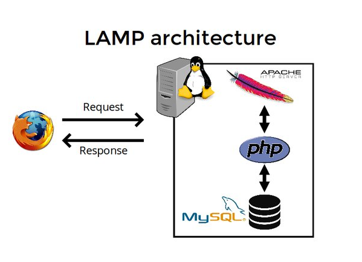

# VAGRANT: WordPress Deployment of a LAMP stack on Ubuntu-based servers. - Instructor's Guide

## Project Overview
In this project, I will guide you through the process of installing a LAMP stack for WordPress on Ubuntu 22.04.2 LTS. The LAMP stack consists of `Linux` as the operating system, `Apache` as the web server, `MySQL` as the database management system, and `PHP` as the server-side scripting language. By setting up this stack, you will have a powerful foundation to run WordPress and create dynamic websites.

I will walk you through each step of the installation process, from updating your system packages to configuring WordPress.

By the end of this tutorial, you’ll have a fully functional LAMP stack ready to host your WordPress site.

**NOTE**: As prerequisites for this project, you should be familiar with `vagrant`, `virtual machine` and `virtualization technology`, `Linux`, and `Bash scripting`.

## Project Objectives
- Automate the provisioning of an Ubuntu-based server, named "Ubuntu_LAMP" using Vagrant.

- On the Ubuntu_LAMP server, create a bash script to automate the deployment of a LAMP (Linux, Apache, MySQL, PHP) stack.

- This script should clone a PHP application from GitHub, install all necessary packages, and configure Apache web server and MySQL.

- Ensure the bash script is reusable and readable.

## Install WordPress
Now that we have Apache, MySQL, and PHP installed, let’s proceed with setting up WordPress. First, we will download the WordPress installation files and place them in the default web server root directory /var/www/html/

``bash
  cd /var/www/html/
``

Now download the latest WordPress install with the following command.

``sudo wget https://wordpress.org/latest.tar.gz``

Extract the files

``sudo tar -xzvf latest.tar.gz``

**Note**: The user of your web server must own these files.

Running the command will show the owner of the apache2 webserver

`ps aux | grep apache2`

To set the correct ownership and permissions for the extracted WordPress files located at /var/www/html/wordpress/ run the following command

sudo chown -R www-data:www-data /var/www/html/wordpress/

## Create a Database for WordPress
Log in to your MySQL root account via Terminal by entering

`sudo mysql -u root -p`

Once logged in, Create a separate database for WordPress to manage

CREATE DATABASE wordpress_db;
CREATE USER 'wordpress_user'@'localhost' IDENTIFIED BY 'Testpass1!';
GRANT ALL PRIVILEGES ON wordpress_db.* TO 'wordpress_user'@'localhost';
FLUSH PRIVILEGES;