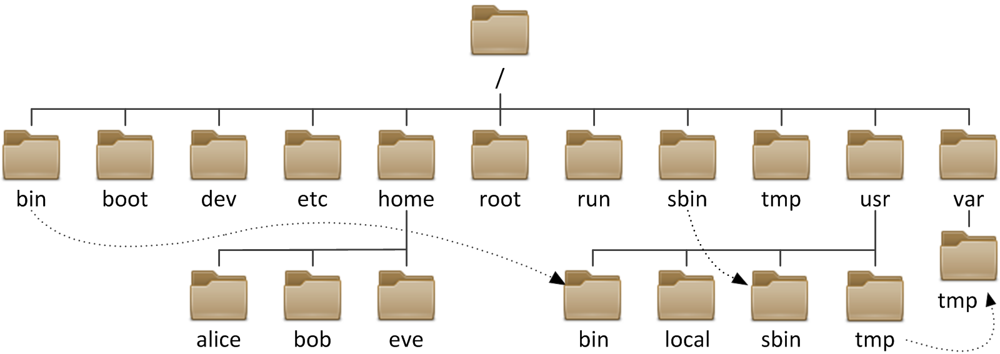

# Understanding the Linux Filesystems

Libraries separate books and other media into multiple sections; this organization will depend on the subject matter, audience, media type, and frequency of retrieval. The same concept applies to a filesystem, which is the embodiment of a method of storing and organizing arbitrary collections of data in a human-usable form.

Different types of filesystems supported by Linux:

- Conventional disk filesystems: ext3, ext4, XFS, Btrfs, JFS, NTFS, vfat, exfat, etc.
- Flash storage filesystems: ubifs, jffs2, yaffs, etc.
- Database filesystems
- Special purpose filesystems: procfs, sysfs, tmpfs, squashfs, debugfs, fuse, etc.

This section will describe the standard filesystem layout shared by most Linux distributions.

## The Filesystem Hierarchy Standard (FHS)
Linux systems store their important files according to a standard layout called the Filesystem Hierarchy Standard (FHS), which has long been maintained by the Linux Foundation. For more information, take a look at the following document: ["Filesystem Hierarchy Standard"](https://refspecs.linuxfoundation.org/FHS_3.0/fhs-3.0.pdf) created by LSB Workgroup. Having a standard is designed to ensure that users, administrators, and developers can move between distributions without having to re-learn how the system is organized.

### Explanation of System Directories

### **Symbolic Links (Less Significant)**
| Directory | Description |
|-----------|-------------|
| `/sbin -> /usr/sbin` | System binaries for administrative commands (linked to `/usr/sbin`). |
| `/bin -> /usr/bin` | Essential user binaries (linked to `/usr/bin`). |
| `/lib -> /usr/lib` | Shared libraries and kernel modules (linked to `/usr/lib`). |

### **Important System Directories**
| Directory | Description |
|-----------|-------------|
| `/boot` | Stores files needed for booting the system (not relevant in containers). |
| `/usr` | Contains most user-installed applications and libraries. |
| `/var` | Stores logs, caches, and temporary files that change frequently. |
| `/etc` | Stores system configuration files. |

### **User & Application-Specific Directories**
| Directory | Description |
|-----------|-------------|
| `/home` | Default location for user home directories. |
| `/opt` | Used for installing optional third-party software. |
| `/srv` | Holds data for services like web servers (rarely used in containers). |
| `/root` | Home directory for the root user. |

### **Temporary & Volatile Directories**
| Directory | Description |
|-----------|-------------|
| `/tmp` | Temporary files (cleared on reboot). |
| `/run` | Holds runtime data for processes. |
| `/proc` | Virtual filesystem for process and system information. |
| `/sys` | Virtual filesystem for hardware and kernel information. |
| `/dev` | Contains device files (e.g., `/dev/null`, `/dev/sda`). |

### **Mount Points**
| Directory | Description |
|-----------|-------------|
| `/mnt` | Temporary mount point for external filesystems. |
| `/media` | Mount point for removable media (USB, CDs). |
| `/data` | Likely your **mounted volume** from Windows (`C:/ubuntu-data`). |