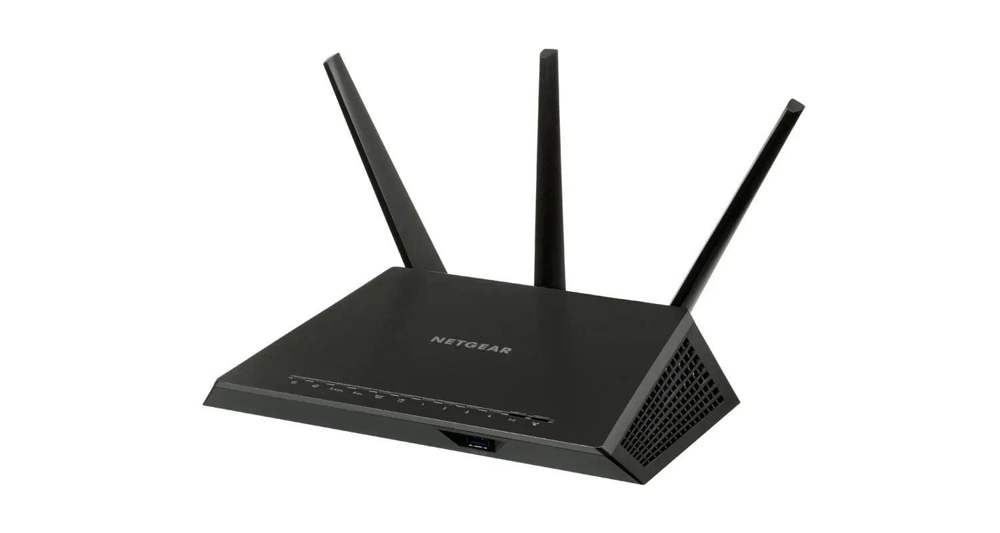
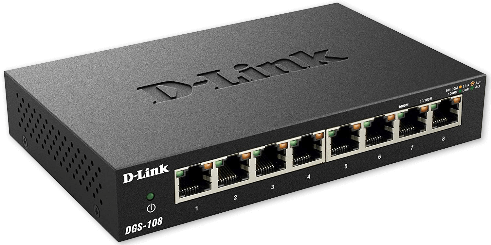
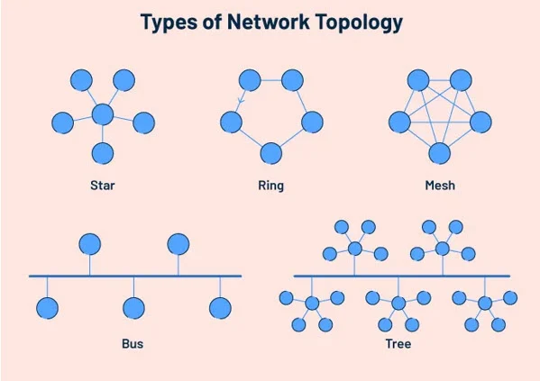
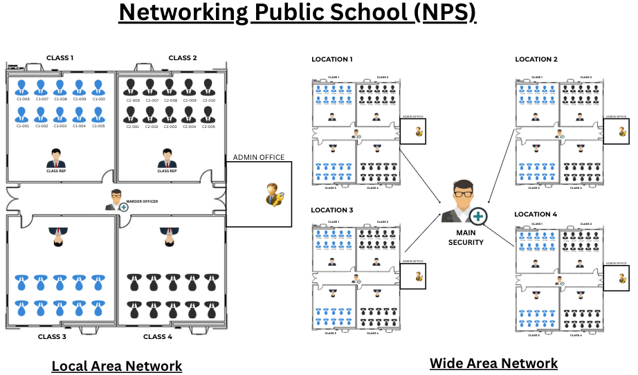
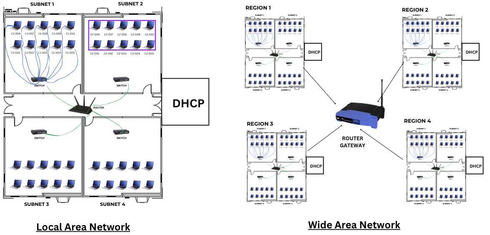
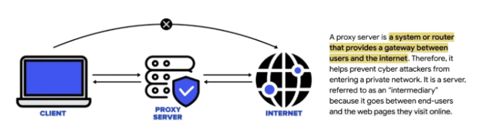
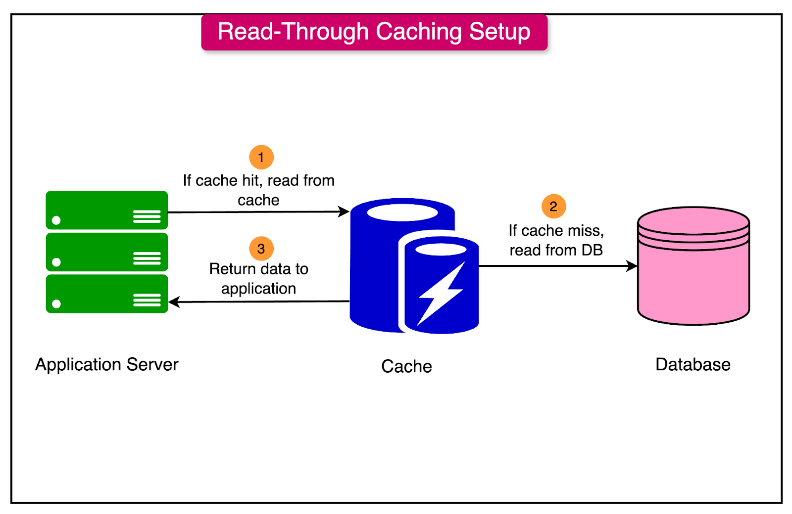
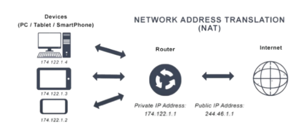
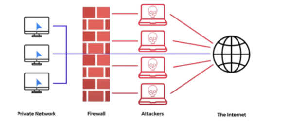

# Computer Networking

A computer network is simply a group of computers and devices linked together in a way that allows them to communicate and share resources with each other.

These devices are linked using physical cables (like Ethernet) or wireless technologies (like Wi-Fi).

## How does a computer network work?
A computer network works by connecting multiple devices (computers, servers, routers, etc.) so they can exchange data and share resources efficiently. Here’s a simple breakdown of how it works:

1. **Establishing the Networ**k: To start, devices need to be connected—forming a network. This can be done physically through cables (like Ethernet), or wirelessly (via Wi-Fi)

2. **Communication Protocols**: Now that our network is established, devices need to 'speak the same language' to communicate effectively. This 'language' is known as a protocol. Some widely recognized ones include HTTP (for web traffic), FTP (for file transfers), and the foundational protocol that governs Internet traffic—TCP/IP. (More on these later)

3. **Data Transmission**: Now that communication is up and running, it's time for our devices to send and receive data. This data is broken down into small chunks or 'packets' to be sent across the network to the receiving device

4. **Routing**: A packet doesn't necessarily travel straight from the source to the destination. It journeys across the network, guided by various devices (like routers and switches) to reach its final destination. 

5. **Data Receipt and Confirmation**: Upon reaching the destination, the receiving device sends a confirmation back to the sender. If the sender doesn't receive this confirmation indicating that something went awry with the transmission, it will attempt to resend the data

## Networking basics: Important terms and concepts

Before we get into more complex networking details, we need to take a second and learn some basic networking terms and concepts:

1. **Node**: A node is the term used to describe any device that can send, receive, or forward information on a network. This could be a computer, a mobile phone, a printer, a switch, or a router

2. **Network Interface Card (NIC)**: Each node has a NIC, which creates a physical connection to the network. NIC helps devices provide a connection to the internet so that devices can connect with the network. And, We require two addresses to communicate between two networked devices that are: 
    - IP address and 
    - a MAC address.

Ethernet Port, Wifi Card, and USB NIC

3. **MAC Address**: This 'Media Access Control' address also known as Physical and hardware address is a unique and permanent address assigned to a NIC by its manufacturer. It's like your device's postal address on the network.

The first six digits 00:1B:44 is called *Organizational Unique Identifier (OUI)*, is provided by the manufacturer and the rest of the digit is 11:3A: B7 which is *NIC Address*.

4. **IP Address**: This is another unique identifier, but assigned by the network according to its own rules. Think of it as a temporary P.O. Box number that can change. There are 4 basic types of IP addresses:
    - **Public IP**: accessible directly over the internet.
    - **Private IP**: address is available within a local network but not accessible directly over the internet.
    - **Static IP**: manually configures and fixes to their device’s network
    - **Dynamic IP**: automatically assigned to a network when a router is set up using Dynamic Host Configuration Protocol (DHCP)

5. **Router**: This hardware device routes data from one network to another. Picture it as a traffic officer, directing packets of data along the network to prevent congestion and ensure data gets to the right place

6. **Switch**: Yet another vital network device, a switch connects devices on a network. It operates much like a multi-port bridge, further directing traffic

7. **Packet**: Information sent over a network is broken into smaller pieces called packets. These are like the individual letters that make up a word or the words that make up a page

8. **Bandwidth**: This reflects the maximum amount of data that can be sent over a network connection in a given time. It can be likened to the width of a highway: a wider highway can accommodate more cars (But cars still need to be the same width and size)

9. **Protocol**: These are the set of rules that dictate how data is transferred on a network. Picture it as conversational etiquette that all devices on the network must adhere to, much like traffic on a highway

10. **Ethernet**: This is the most common protocol for wired Local Area Networks (LANs). If you've seen a cable connecting a computer to the internet, you've seen Ethernet at work.

11. **Wi-Fi**: This is a protocol for wireless networking, where devices connect to a network through a Wi-Fi router

12. **TCP/IP**: The Transmission Control Protocol/Internet Protocol is the fundamental protocol that governs data transfer over the internet

13. **Firewall**: This is a network security system that monitors and controls incoming and outgoing network traffic, akin to a security guard checking who enters and leaves a building

14. **VPN**: A Virtual Private Network extends a private network over a public one, like the Internet. This allows users to send and receive data as if their devices were directly connected to the private network

15. **Network Topology**: This refers to how various elements (nodes, links, etc.) are arranged in a network. This structure determines how information is transferred across the network.
    - **Bus Topology**
    - **Ring Topology**
    - **Star Topology**
    - **Mesh Topology**
    - **Tree/Hybrid Topology**

16. **ISP**: Your Internet Service Provider is the company that provides your Internet access

## Analogy

### Case Study 1

### Case Study 2

## Funtions of Router Gateway

## Proxy Server

## Caching
Caching is a technique in computing that stores frequently accessed data or resources in a temporary storage location, called a cache, to improve performance by enabling faster retrieval.

## Network Address Translation (NAT)

## Firewall

## Import Links
* https://zerotomastery.io/blog/introduction-to-networking/