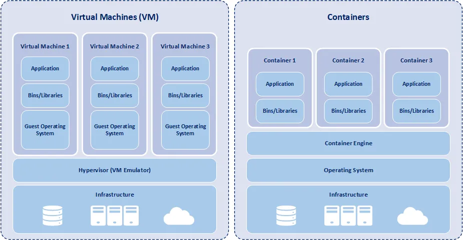

# 📦 Module 1: Introduction to Containers and Docker

## What is Docker?

Docker is an open-source platform that automates the deployment, scaling, and management of applications inside containers.

*Docker simplifies the deployment process, reduces issues related to “on my machine everything works” problems, and has become an integral tool for both developers and operations teams (DevOps) to streamline and optimize the software development life cycle.*


## What is a Container?

A container is a lightweight, stand-alone, and executable software package that contains everything needed (code, runtime, system tools, libraries, and settings) to run a piece of software.

Containers are isolated from each other and from the host system, ensuring consistent operation across various computing environments.

### Popular Container Providers:
Docker, Rocket (rkt), Linux Containers (LXC), CRI-O, containerd.

**Virtual Machines (VMs)**: Virtual machines emulate a complete physical computer, including hardware components such as CPU, memory, storage, and network interfaces. Each VM runs its own operating system (OS), which is fully isolated from the host system and other VMs.


## Containers vs. Virtual Machines
Containers and virtual machines are both technologies used to isolate applications and their dependencies, but they have some key differences:



| Containers | Virtual Machines |
|-----------|-------------|
| Share the host OS | Run separate OS instances  |
| Faster startup | Slower due to OS boot  |
| Lightweight | Heavy due to full OS |
| Use fewer resources | Use more system resources  |
| Easy to ship (deploy) | Not easy to ship  |


## Key Benefits and Features of Containers:

* **Consistency**: Since a container is derived from an image, it ensures that the application runs consistently across different environments, from a developer’s local machine to staging and production servers.

* **Isolation**: Even though containers share the same OS kernel, they operate independently.
If one container crashes, it doesn’t affect others.
Processes, file systems, memory, and the network stack are all segregated. This prevents potential conflicts and ensures security.

* **Lightweight**: Unlike virtual machines, which require an entire operating system to run, containers share the host system’s kernel but maintain their own user space. This makes them more efficient in terms of resource utilization.

* **Ephemeral**: Containers can be thought of as ephemeral or temporary. They can be easily created, started, stopped, and destroyed without affecting the underlying image or other containers.


## Why DevOps Uses Docker

- Simplifies deployment

- Ensures consistency across environments

- Scales easily in production

- Speeds up CI/CD pipelines


## Installation:

A very detailed instructions to install Docker are provide in the below link

https://docs.docker.com/get-docker/

For Demo,

You can create an Ubuntu EC2 Instance on AWS and run the below commands to install docker.

```bash
sudo apt update
sudo apt install docker.io -y
```

