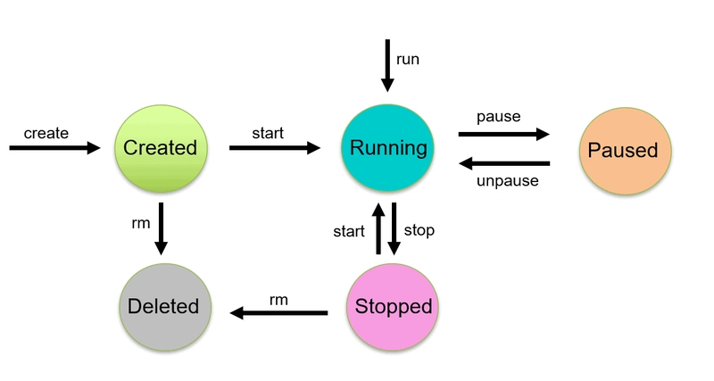
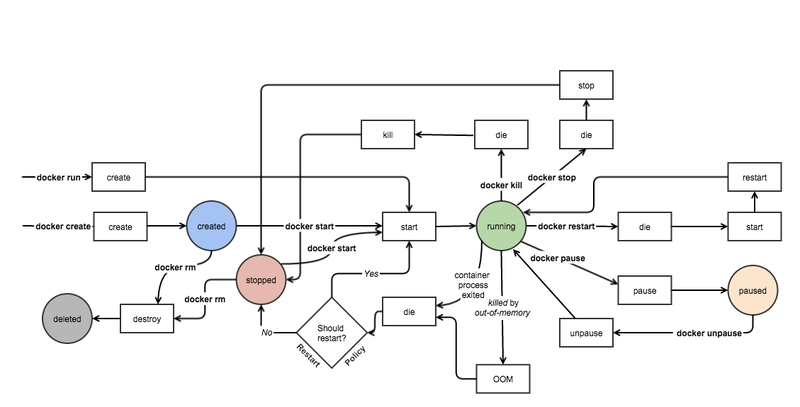

# Module 2: Working with Docker Images and Containers


## Understanding Docker architecture


The above picture, clearly indicates that Docker Deamon is brain of Docker. If Docker Deamon is killed, stops working for some reasons, Docker is brain dead :p (sarcasm intended).

## Understanding the terminology (Inspired from Docker Docs)

### Docker daemon
The **Docker daemon (dockerd)** listens for Docker API requests and manages Docker objects such as `images`, `containers`, `networks`, and `volumes`. A daemon can also communicate with other daemons to manage Docker services.


### Docker client
The **Docker client (docker)** is the primary way that many Docker users interact with Docker. When you use commands such as `docker run`, the client sends these commands to dockerd, which carries them out. The docker command uses the Docker API. The Docker client can communicate with more than one daemon.

### Docker Desktop
Docker Desktop is an easy-to-install application for your Mac, Windows or Linux environment that enables you to build and share containerized applications and microservices. Docker Desktop includes the Docker daemon (dockerd), the Docker client (docker), Docker Compose, Docker Content Trust, Kubernetes, and Credential Helper. For more information, see [Docker Desktop](https://docs.docker.com/desktop/).

### Docker registries
A Docker registry stores Docker images. **Docker Hub** is a public registry that anyone can use, and Docker is configured to look for images on Docker Hub by default. You can even run your own private registry.

When you use the docker pull or docker run commands, the required images are pulled from your configured registry. When you use the docker push command, your image is pushed to your configured registry.

When you use Docker, you are creating and using images, containers, networks, volumes, plugins, and other objects. This section is a brief overview of some of those objects.

### Dockerfile
Dockerfile is a file where you provide the steps to build your Docker Image.

### Images
An image is a read-only template with instructions for creating a Docker container. Often, an image is based on another image, with some additional customization. For example, you may build an image which is based on the ubuntu image, but installs the Apache web server and your application, as well as the configuration details needed to make your application run.

You might create your own images or you might only use those created by others and published in a registry. To build your own image, you create a Dockerfile with a simple syntax for defining the steps needed to create the image and run it. Each instruction in a Dockerfile creates a layer in the image. When you change the Dockerfile and rebuild the image, only those layers which have changed are rebuilt. This is part of what makes images so lightweight, small, and fast, when compared to other virtualization technologies.

## Basic Docker Concepts:

* **Docker Image**: This is like the blueprint for a container, a snapshot containing the application and all its requirements.

* **Docker Container**: A live, operational version of the Docker image.

* **Dockerfile**: A script with commands to build a Docker image. It defines how the image should be constructed.

* **Docker Hub**: A cloud-based registry where Docker users and partners can create, test, store, and distribute container images.


## Docker Commands

### Pulling Docker Images

```bash
# Pull nginx image
docker pull nginx
```

### List all available Images

```bash
docker images ls
```

Docker image management commands includes: `history`, `import`, `inspect`, `load`, `ls`, `prune`, `pull`, `push`, `rm`, `save`, and  `tag`

[Reference](https://docs.docker.com/reference/cli/docker/image/): All docker image commands

### run a container / detached mode

```bash
docker run nginx:latest

docker run -d nginx:latest
```

### list all running container

```bash
docker container ls

docker ps
```

### list all available container

```bash
docker ps -a
```

### Expose container port

```bash
docker run -d -p 8080:80 nginx:latest
```

### Expose multiple container port

```bash
docker run -d -p 8080:80 -p 3000:80 nginx:latest
```

### Naming container

```bash
docker run -name my-sebsite -d -p 8080:80  nginx:latest
```

## Lifecycle of a docker container 



The lifecycle of a docker container consists of five states:

1. Created state
2. Running state
3. Paused state/unpaused state
4. Stopped state
5. Killed/Deleted state

### Complete lifecycle of a Docker container


### Create Containers
Using the docker create command will create a new Docker container with the specified docker image.

```bash
docker create --name <container name> <image name>
```

### Start Container
To start a stopped container, we can use the docker start command.

```bash
docker start <container name>
```

### Run Container
The `docker run` command will do the work of both `docker create` and `docker start` command. This command will create a new container and run the image in the newly created container.

```bash
docker run --name <container name> <image name>
```

### Pause Container
If we want to pause the processes running inside the container, we can use the `docker pause` command.

```bash
$ docker pause <container name>
```

To unpause the container, use **`docker unpause`** command.

### Stop Container
Stopping a running Container means to stop all the processes running in that Container. Stopping does not mean killing or ending the process.

```bash
$ docker stop <container name>
```

### Delete Container
Removing or deleting the container means destroying all the processes running inside the container and then deleting the Container. It’s preferred to destroy the container, only if present in the stopped state instead of forcefully destroying the running container.

```bash
docker stop <container name>
docker rm <container name>
```

### Kill Container
We can kill one or more running containers.

```bash
$ docker kill <container name>
```

## Detached vs Interactive Mode

- Detached mode (-d): Runs container in background

- Interactive mode (-it): Attaches your terminal to the container
