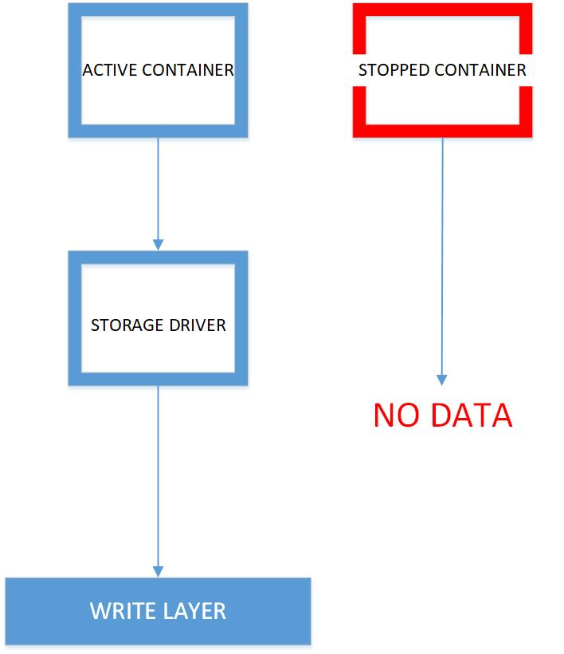
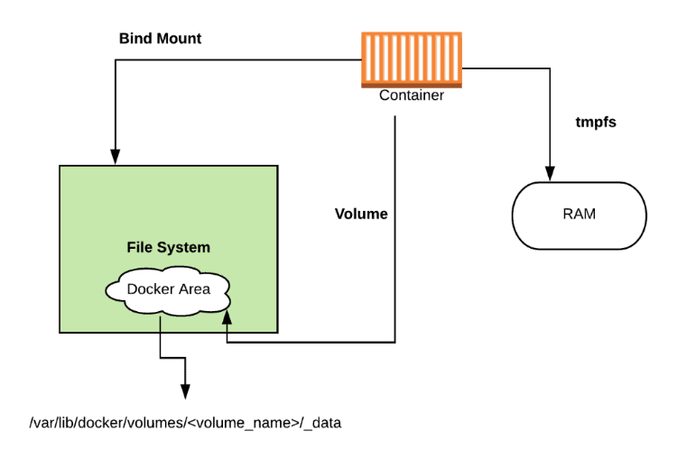
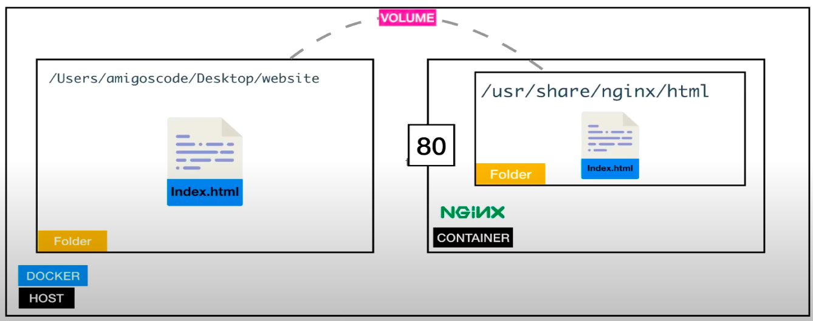
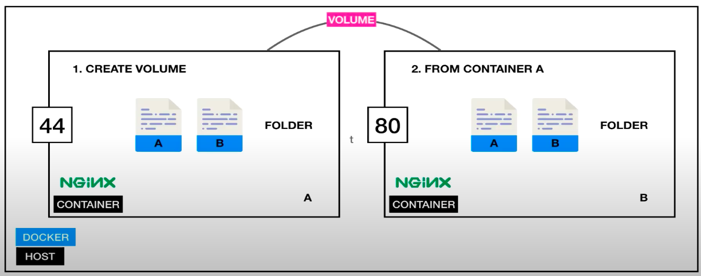

# Docker Volumes & Persistent Storage

Containers don’t write data permanently to any **storage location**. Docker storage must be configured if you would like your container to store data permanently. The data doesn’t prevail when the container is **deleted (using the remove command)**; this happens because when the **container is deleted**, the writable layer is also **deleted**. If the data is stored **outside** the container you can use it even if the container no longer exists.



If a container crashes and can’t be restored/restarted the data is gone! But, normally containers can be restarted and continued – in that case, the data is not lost. So, it’s always advisable moreover mandatory to mount the data outside the container.

If you are wondering why can’t containers just hold all the data,  it is because the containers are designed to be small, run quickly, with all backend storage outside the container

However, it’s possible to make containers store their data. They do so in so-called layers for which they need a storage driver. There are 3 ways to achieve this. The primary 2 ways use the host’s storage space:
- **Volumes** and 
- **Bind Mounts**

The third way writes directly on to the 
- **host memory (tmpfs)** 




The difference between these three are: 
- **volumes**: 
    - stores data permanently
    - have a dedicated filesystem on the host `(/var/lib/ docker/volumes)` - directly controlled through the Docker CLI

- **Bind mounts**: 
    - stores data permanently
    - use any available host filesystem. 

- **tmfs**: 
    - stores data temporarily
    - uses the host memory.


## Docker Bind Mount
Docker bind mount is a permanent storage option but with more limited options than Docker volume. It can’t be managed via Docker CLI and is totally dependent on the availability of the filesystem of the host. A host filesystem can be created when running a container.

### Bound Mount (Host and Container)


#### Commands:
**bind mount**: note that the host path should start with ‘/’. Use $(pwd) for convenience.

```bash
# unnamed volume
docker run -v /host-path:/container-path image-name

# named volume
docker run -v /container-path image-name  
```


### Bound Mount (Container and Container)


```bash
docker run -volume-from container-name(s) image-name
```

## Docker Volume
Docker volume is the most commonly used technology for the permanent storage of container data. Docker volume is managed by Docker itself and has a dedicated filesystem on the host, doesn’t depend upon the filesystem structure on the host. Docker volumes are explicitly managed via the Docker command line and can be created alone or during container initialization. The command used is docker `volume create`.

When stopping or deleting a container, Docker volume remains permanently stored. The volumes are often manually deleted with the `docker volume prune` command. Multiple containers can be connected to the same Docker volume

| Command | Description |
|-----------|-------------|
| `docker volume create`	 | Create a volume  |
| `docker volume inspect`	 | Display detailed information on one or more volumes  |
| `docker volume ls`	 | List volumes |
| `docker volume prune`	 | Remove all unused local volumes  |
| `docker volume rm`	 | Remove one or more volumes |


## Docker Volume Use Cases
- To share data between multiple containers.
- Backup and restore data.
- Connect to a remote location (cloud).
- Dedicated container-only filesystem.


## tmpfs Mounts
**tmpfs** is a third storage option that is **not permanent** like Docker volume or bind mount. The data is written directly on to the host’s memory and deleted when the container is stopped. Very useful when it involves sensitive data that you simply don’t want to be permanent. A really significant difference is that containers can’t share tmpfs space unless they’re running on Linux OS. 

```bash
docker run -d --name tmptest --mount type=tmpfs,destination=/app nginx:latest
docker run -d --name tmptest --tmpfs /app nginx:latest
```