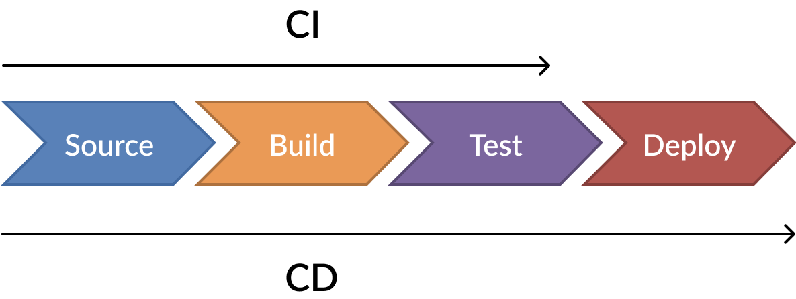

# 1. Introduction to CI/CD

## Definition and Core Concepts
**CI/CD** (Continuous Integration and Continuous Delivery/Deployment) automates the software delivery process by integrating code changes frequently and deploying them reliably.

In the field of DevOps and software development, CI/CD streamlines the processes of coding, testing, and deploying applications by providing teams with a single repository to store their work, along with automation tools to consistently and frequently integrate, test, and deploy the code to production.

- **Continuous Integration (CI)**  
  Developers merge code changes into a shared repository multiple times daily. Each merge triggers:
  - Automated builds
  - Test suites (unit, integration, etc.)
  - Immediate feedback on failures

- **Continuous Delivery (CD)**  
  Ensures code is always in a deployable state after CI. Includes:
  - Automated staging deployments
  - Manual approval gate for production

- **Continuous Deployment (CD)**  
  Extends delivery by automatically deploying to production after passing tests (no manual approval).

## Benefits of CI/CD
| Benefit               | Impact                                                                 |
|-----------------------|-----------------------------------------------------------------------|
| Faster Releases       | Reduce manual steps → Accelerate time-to-market                      |
| Early Bug Detection  | Fail fast with immediate test feedback                               |
| Reduced Risk         | Smaller, incremental changes minimize deployment failures           |
| Improved Quality     | Enforced code standards and automated testing                        |
| Rollback Capability  | Quick recovery from failed deployments                              |

## CI vs CD vs CD: Key Differences

```diff
# Continuous Integration (CI)
- Focus: Code merging and validation
- Automation: Build + test
- Outcome: "The code works together"

# Continuous Delivery (CD)
- Focus: Release readiness
- Automation: CI + staging deployment
- Outcome: "We can deploy anytime" (manual prod trigger)

# Continuous Deployment (CD)
- Focus: Production releases
- Automation: Full pipeline (including prod)
- Outcome: "Every change goes live automatically"
```

## CI/CD Pipeline Stages and Phases 



Typical stages of a CI/CD pipeline:

1. **Source**:
    
    The source stage, often referred to as the version control stage, forms the bedrock of the CI/CD pipeline. It involves the management and storage of source code in a controlled and versioned manner.  This stage might include:

    - Initial quality checks.
    - Unit Tests.
    - Linting or syntax checks.
    - Ensure the code follows standards and styles.

2. **Build**:

    The build stage is a critical phase of the CI/CD pipeline where the source code, collected in the source stage, gets transformed into a tangible product that can be executed in an environment. This transformation depends on the type of application being built. For instance, for Java applications, this phase involves compiling the source code into bytecode and packaging it into a JAR or WAR file. In the case of applications destined for a Docker environment, a Docker image is built using a Dockerfile.
    
    - Static Code Analysis.
    - Code Quality/Vulnerability Testing.
    - Resolving dependencies
    - Artifact: deployeable state of the application (e.g., JAR, Docker image).

3. **Test**:

    The test stage is where the application is subjected to comprehensive automated testing to ensure it meets all functional and non-functional requirements. It’s in this phase that the quality of the build is thoroughly vetted before it reaches end-users.

     - Functional Tests.
     - Integration Tests.
     - Performance Tests.
     - Security Tests.

4. **Deploy**:

    The deploy stage is the final part of the CI/CD pipeline, where the application is released into the production environment, making it accessible to end-users. This process involves moving the built and tested software to the server or cloud platform where it will run.

    The deployment process varies based on the nature of the application and the production environment. For instance, it could involve deploying a Docker container to a Kubernetes cluster, updating a web application on a cloud service like AWS or Google Cloud, or simply uploading files to a server.

5. **Notify**: Inform stakeholders or systems (e.g., Slack, email).


## Best Practices to Optimize the CI/CD Process 

Optimizing the CI/CD process can improve efficiency, reduce errors, and increase the overall quality of your software development process. Here are some best practices to optimize your CI/CD pipeline:

- Maintain a single source repository.
- Automate everything.
- Use a consistent build process.
- Implement parallelization.
- Use build artifacts.
- Implement comprehensive testing.
- Manage environment configurations.
- Monitor and improve
- Foster a culture of collaboration.
- Keep security in mind.