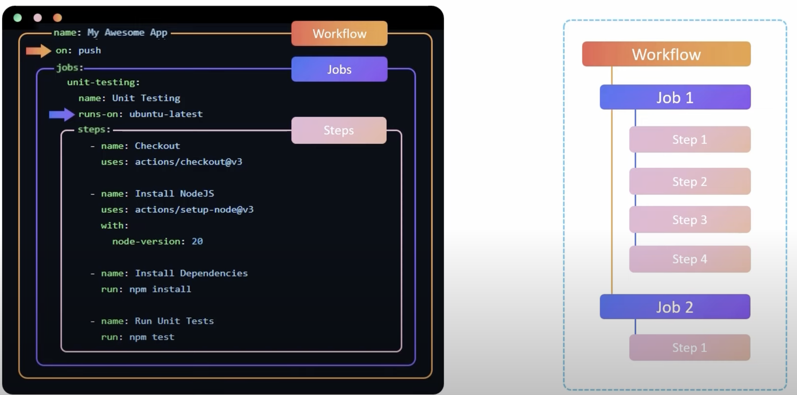

# Create your first Github Action

## Core Components



## 1. Create the Workflow File
In your repository, create a new folder and file:
```bash
.github/workflows/first-action.yml
```

**Note**: For GitHub to discover any GitHub Actions workflows in your repository, you must save the workflow files in a directory called `.github/workflows`.

## 2. Add Basic Workflow Configuration
```bash
# This is your first GitHub Actions workflow file

name: First GitHub Action  # The name of the workflow visible in the GitHub Actions tab

on:
  push:
    branches: [ main ]  # Trigger this workflow when code is pushed to the 'main' branch

jobs:
  say-hello:  # A job named 'say-hello'
    runs-on: ubuntu-latest  # The environment where this job will run

    steps:
      - name: Checkout the repo  # Step 1: Pull the code from the repo into the runner
        uses: actions/checkout@v3  # Reuse the official checkout action

      - name: Say Hello  # Step 2: Print a greeting to the logs
        run: echo "🎉 Hello, GitHub Actions!"  # This is a shell command

      - name: List files  # Step 3: list all the files 
        run: ls -ltr

      - name: Read File  # Step 3: Read file
        run: cat README.md
    

```

## Components?
| Section               | Purpose                                                                 |
|-----------------------|-----------------------------------------------------------------------|
| `name`       | Name of your workflow                   |
| `on`  | Trigger type (here: when pushing to main)                               |
| `jobs`         | Defines what the workflow will do        |
| `runs-on`     | Specifies the environment (e.g., Ubuntu)           |
| `steps`  | Sequential commands or reusable actions                        |
| `run`     | Inline shell command           |
| `uses`  | Reuses a public GitHub Action module                        |

## 4. Commit and Push
```bash
git add .github/workflows/first-action.yml
git commit -m "Add first GitHub Action"
git push origin main
```

GitHub will automatically detect and run your workflow!

Visit the [Github marketplace](https://github.com/marketplace) to see a list of  more Github Actions. 

## Executing Mutliple Line Commands

```bash
# This is your first GitHub Actions workflow file
...
...
      - name: Say Hello  # execute multiple commands
        run: |
            echo "🎉 Hello, GitHub Actions!"
            ls -ltr
            cat README.md
    
```