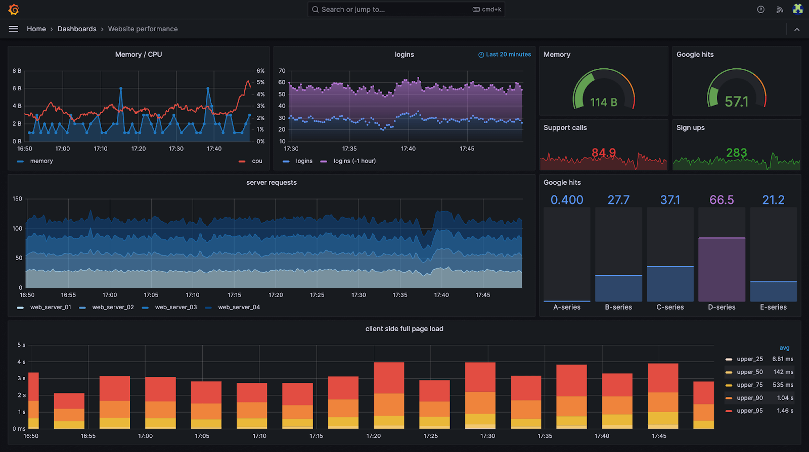

# How Grafana Works

Grafana is an open-source visualization and monitoring platform developed by Grafana Labs. It allows you to query, visualize, alert on, and understand your data from various data sources through highly customizable dashboards. 

## Grafana Use Cases
- Infrastructure monitoring 
- Application performance monitoring (APM)
- Business intelligence and analytics 

## Grafana Core Components: Dashboards and Panels
At the heart of Grafana’s user interface are **dashboards and panels**. 

Dashboards provide a visual representation of data and are composed of individual panels arranged in a grid. 

Panels are the building blocks of a Grafana dashboard, serving as containers for visualizing data. Panels offer a wide range of visualization formats to present data in meaningful ways, such as:

- Time series graphs
- Stats and gauges
- Tables
- Heatmaps and histograms
- Alert lists
- And many more...