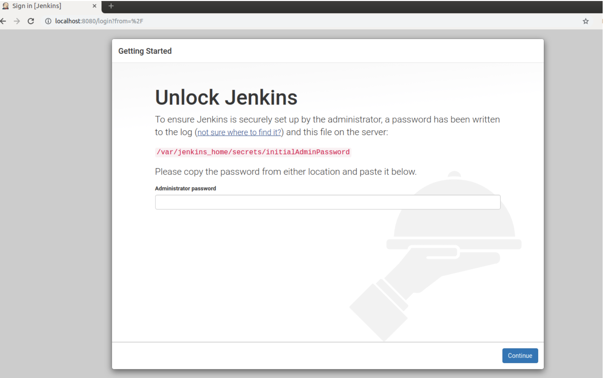
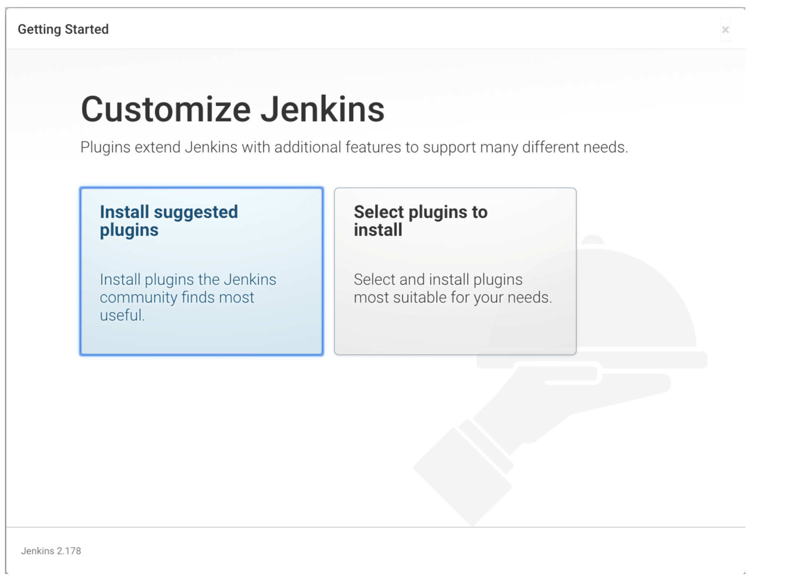
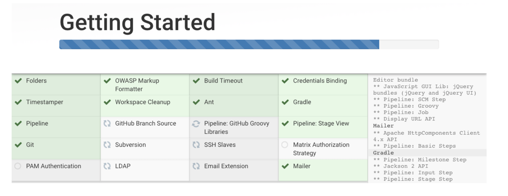
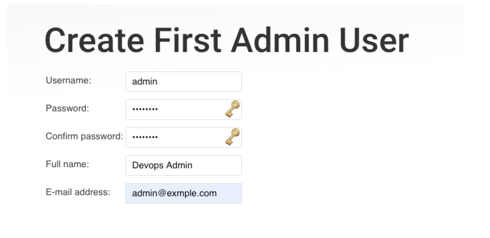

# Setup Jenkins with Docker

## Objectives

- You will launch Jenkins along with Docker Server (DIND) as your Continuous Integration Lab Environemnt
- You will do the initial Jenkins configurations including installing plugins, configuring admin user and get Jenkins ready to start building your CI workflows


Ensure that you have Docker Installed on your system. 

```bash
docker version
docker-compose
```

The first command should show you both , client and server information. The second command should return the help menu for docker compose, which validate that you have Doker installed, started and docker-compose ready to go.

Now, you could launch a jenkins container on your docker host by using recommended jenkins image similar to whats recommended in the official documentation [Docker]() using the following sequence of commands.

```bash
cd jenkins-setup
docker compose build
docker compose up -d
```

You could validate that Jenkins is setup along with Docker using the following command

```bash
docker compose ps
```

You could now access jenkins UI by browsing to `http://IPADDRESS:8080`




To fetch the initialAdminPassword use the following command

```bash
docker compose logs jenkins
```

Copy the exact password that you see on your screen and paste it on the Jenkins UI to unlock.


In the next step , choose install suggested plugins to configure the default plugins automatically.




You can also observe the progress of plugins installation process as follows,





If the plugins installation process fails, you could retry it.
Once plugins are installed, you will create the admin user using the form presented.




completing this process will get you to jenkins configuration page, and continuing that will take you to the main page where you could get started creating jobs from.

## Stopping, Starting and Resetting Jenkins

While you start building your Continuous Integration workflows, there would be times when you would need to stop and start this environment e.g. you shut down your laptop at the end of the day and then start if the next day, and you would want your learning lab environment to be back up and running.

This can be achieved by gracefully stopping your lab environment with,

```bash
docker compose stop
```

and then when you start your system, by executing

```bash
docker-compose up -d
```