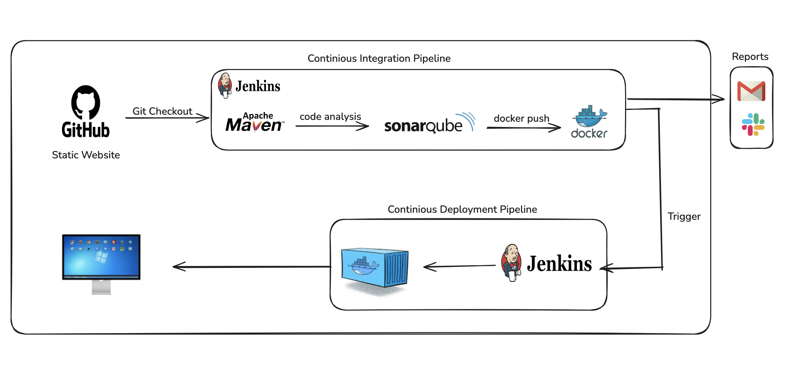

# Jenkins Pipeline for Java Web (Spring + Thymeleaf) base application using Maven, SonarQube and Docker 


 
This is a demo project for practicing Spring + Thymeleaf. The idea was to build some basic shopping cart web app.

It was made using Spring Boot, Spring Security, Thymeleaf, Spring Data JPA, Spring Data REST and Docker. Database is in memory H2.

There is a login and registration functionality included.

Users can shop for products. Each user has his own shopping cart (session functionality). Checkout is transactional.

## Execute the application locally and access it using your browser

Checkout the repo and move to the directory

```
git clone https://github.com/intellisenseCodez/devops_training_guide/tree/main/14-Jenkins/projects/java-web-app

cd 14-Jenkins/projects/java-web-app
```

Execute the Maven targets to generate the artifacts

```
mvn clean package
```

The above maven target stroes the artifacts to the `target` directory. You can either execute the artifact on your local machine
(or) run it as a Docker container.

** Note: To avoid issues with local setup, Java versions and other dependencies, I would recommend the docker way. **


### Execute locally (Java 11 needed) and access the application on http://localhost:8080

```
java -jar target/spring-boot-web.jar
```

### The Docker way

Build the Docker Image

```
cd 14-Jenkins/projects/java-web-app
docker build -t shopping-cart:v1 -f docker/Dockerfile .
```

```
docker run -d -p 8010:8080 -t shopping-cart:v1
```

Hurray !! Access the application on `http://<ip-address>:8010`


# CICD Project Setup

### 1. Create an EC2 Instance
- Go to AWS Console
- Instances
- Launch instances

### 2. Install Jenkins.

**Install Java (JDK)**

### Run the below commands to install Java and Jenkins

Install Java

```
sudo apt update
sudo apt install openjdk-17-jre
```

Verify Java is Installed

```
java -version
```

**Install Jenkins Server**

Now, you can proceed with installing Jenkins

```
curl -fsSL https://pkg.jenkins.io/debian/jenkins.io-2023.key | sudo tee \
  /usr/share/keyrings/jenkins-keyring.asc > /dev/null
echo deb [signed-by=/usr/share/keyrings/jenkins-keyring.asc] \
  https://pkg.jenkins.io/debian binary/ | sudo tee \
  /etc/apt/sources.list.d/jenkins.list > /dev/null

sudo apt-get update
sudo apt-get install jenkins
```

**Note:** By default, Jenkins will not be accessible to the external world due to the inbound traffic restriction by AWS. Open port `8080` in the inbound traffic rules as show below.

- EC2 > Instances > Click on
- In the bottom tabs -> Click on Security
- Security groups
- Add inbound traffic rules that allow TCP `8080`.

### Login to Jenkins using the below URL:

`http://ec2-instance-public-ip-address:8080` [You can get the ec2-instance-public-ip-address from your AWS EC2 console page]

After you login to Jenkins, 
- Run the command to copy the Jenkins Admin Password 
```
sudo cat /var/lib/jenkins/secrets/initialAdminPassword 
```
- Enter the Administrator password.


### 3. Install Sonaqube Server
Install a Sonarqube Server

```bash
# switch to root user to add user
sudo su - 
adduser sonarqube

# switch to the new created user
sudo su - sonarqube

sudo apt install unzip


wget https://binaries.sonarsource.com/Distribution/sonarqube/sonarqube-9.4.0.54424.zip
unzip *
chown -R 755 /home/sonarqube/sonarqube-9.4.0.54424
chown -R sonarqube:sonarqube /home/sonarqube/sonarqube-9.4.0.54424
cd sonarqube-9.4.0.54424/bin/linux-x86-64
./sonar.sh start
```

### 4. Install Docker Server
Run the below command to Install Docker

```bash
# switch to root user to add user
sudo su - 

sudo apt update
sudo apt install docker.io

# Grant Jenkins user and Ubuntu user permission to docker deamon.

usermod -aG docker jenkins
usermod -aG docker ubuntu
systemctl restart docker
```


### 5. Install plugins in Jenkins:
- Log in to Jenkins.
- Go to Manage Jenkins > Manage Plugins.
- In the Available tab, search for 
   - Sonarqube Scanner
   - JDK
   - maven
   - OWASP Dependency
   - Docker
- Select the plugin and click the Install button.
- Restart Jenkins after the plugin is installed.


Once you are done with the above steps, it is better to restart Jenkins.

```
http://<ec2-instance-public-ip>:8080/restart
```

The docker agent configuration is now successful.


