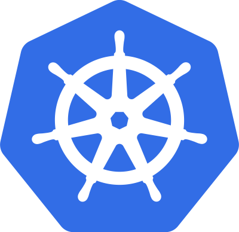

# What Is Container Orchestration?

What Is Container Orchestration?
In Development (Dev) environments, running containers on a single host for development and testing of applications may be a suitable option. However, when migrating to Quality Assurance (QA) and Production (Prod) environments, that is no longer a viable option because the applications and services need to meet specific requirements:

- Fault-tolerance
- On-demand scalability
- ptimal resource usage
- Auto-discovery to automatically discover and communicate with each other
- Accessibility from the outside world
- Seamless updates/rollbacks without any downtime.

Container orchestrators are tools which group systems together to form clusters where containers' deployment and management is automated at scale while meeting the requirements mentioned above. The clustered systems confer the advantages of distributed systems, such as increased performance, cost efficiency, reliability, workload distribution, and reduced latency. Below is a list of a few different container orchestration tools and services available today:

- Amazon Elastic Container Service
- Azure Container Instances
- Azure Service Fabric
- Kubernetes (K8S)
- Nomad
- Docker Swarm

## Why Use Container Orchestrators?

Most container orchestrators can:

1. Group hosts together while creating a cluster, in order to leverage the benefits of distributed systems.

2. Schedule containers to run on hosts in the cluster based on resources availability.

3. Enable containers in a cluster to communicate with each other regardless of the host they are deployed to in the cluster.

4. Bind containers and storage resources.

5. Group sets of similar containers and bind them to load-balancing constructs to simplify access to containerized applications by creating an interface, a level of abstraction between the containers and the client.

6. Manage and optimize resource usage.

7. Allow for implementation of policies to secure access to applications running inside containers.

## Where to Deploy Container Orchestrators?

Most container orchestrators can be deployed on the infrastructure of our choice:
- on bare metal, 
- Virtual Machines, on-premises, on public and 
- hybrid clouds.

Kubernetes, for example, can be deployed on a workstation, with or without an isolation layer such as a local hypervisor or container runtime, inside a company's data center, in the cloud on AWS Elastic Compute Cloud (EC2) instances, Google Compute Engine (GCE) VMs, DigitalOcean Droplets, IBM Virtual Servers, OpenStack, etc.

In addition, there are turnkey cloud solutions which allow production Kubernetes clusters to be installed, with only a few commands, on top of cloud Infrastructures-as-a-Service. These solutions paved the way for the managed container orchestration as-a-Service, more specifically the managed Kubernetes as-a-Service (KaaS) solution, offered and hosted by the major cloud providers. Examples of KaaS solutions are:

- Amazon Elastic Kubernetes Service (Amazon EKS), 
- Azure Kubernetes Service (AKS), 
- DigitalOcean Kubernetes, 
- Google Kubernetes Engine (GKE), 
- IBM Cloud Kubernetes Service, 
- Oracle Container Engine for Kubernetes, or 
- VMware Tanzu Kubernetes Grid.

## What Is Kubernetes?

According to the Kubernetes website,`"Kubernetes is an open-source system for automating deployment, scaling, and management of containerized applications"`.

Kubernetes comes from the Greek word κυβερνήτης, which means helmsman or ship pilot. With this analogy in mind, we can think of Kubernetes as the pilot on a ship of containers.

Kubernetes is also referred to as k8s (pronounced Kate's), as there are 8 characters between k and s.

## Kubernetes Features
Kubernetes offers a very rich set of features for container orchestration. Some of its fully supported features are:

- **Automatic bin packing**

    Kubernetes automatically schedules containers based on resource needs and constraints, to maximize utilization without sacrificing availability.

- **Designed for extensibility**
    
    A Kubernetes cluster can be extended with new custom features without modifying the upstream source code.

- **Self-healing**

    Kubernetes automatically replaces and reschedules containers from failed nodes. It terminates and then restarts containers that become unresponsive to health checks, based on existing rules/policy. It also prevents traffic from being routed to unresponsive containers.

- **Horizontal scaling**
    
    Kubernetes scales applications manually or automatically based on CPU or custom metrics utilization.

- **Service discovery and load balancing**
    Containers receive IP addresses from Kubernetes, while it assigns a single Domain Name System (DNS) name to a set of containers to aid in load-balancing requests across the containers of the set.

Additional fully supported Kubernetes features are:

- **Automated rollouts and rollbacks**

    Kubernetes seamlessly rolls out and rolls back application updates and configuration changes, constantly monitoring the application's health to prevent any downtime.

- **Secret and configuration management**

    Kubernetes manages sensitive data and configuration details for an application separately from the container image, in order to avoid a rebuild of the respective image. Secrets consist of sensitive/confidential information passed to the application without revealing the sensitive content to the stack configuration, like on GitHub.

- **Storage orchestration**

    Kubernetes automatically mounts software-defined storage (SDS) solutions to containers from local storage, external cloud providers, distributed storage, or network storage systems.

- **Batch execution**
    Kubernetes supports batch execution, long-running jobs, and replaces failed containers.

- **IPv4/IPv6 dual-stack**

    Kubernetes supports both IPv4 and IPv6 addresses.

Kubernetes extensibility allows it to support and to be supported by many 3rd party open source tools which enhance Kubernetes' capabilities and provide a feature-rich experience to its users. It's architecture is modular and pluggable. Not only does it orchestrate modular, decoupled microservices type applications, but also its architecture follows decoupled microservices patterns. Kubernetes' functionality can be extended by writing custom resources, operators, custom APIs, scheduling rules or plugins.