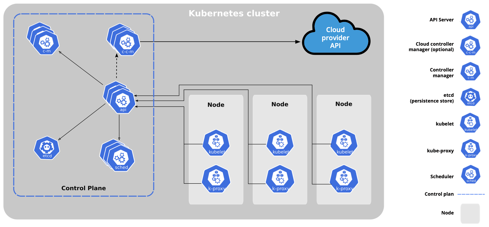

# Kubernetes Architecture

At a very high level, Kubernetes is a cluster of compute systems categorized by their distinct roles:

- One or more control plane nodes
- One or more worker nodes (optional, but recommended).

## Components of the Kubernetes Cluster

- **Control Plane**

    The control plane is responsible for container orchestration and maintaining the desired state of the cluster. It has the following components.

    1. kube-apiserver
    2. etcd (Key-value data store)
    3. kube-scheduler
    4. kube-controller-manager
    5. cloud-controller-manager

    A cluster can have one or more control plane nodes.

- **Worker Node**

    A worker node provides a running environment for client applications. These applications are microservices running as application containers.
    The worker Node has the following components.

    1. kubelet
    2. kube-proxy
    3. Container runtime
    4. Add-ons
