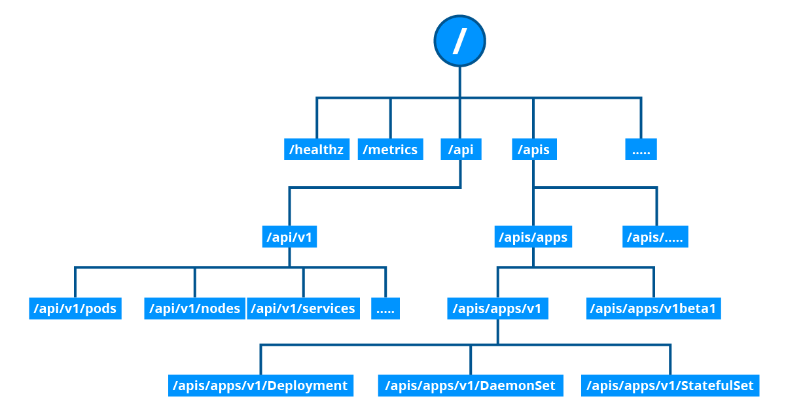

# Minikube: Installing Local Kubernetes Clusters

## What Is Minikube?

Minikube is one of the easiest, most flexible and popular methods to run an all-in-one or a multi-node local Kubernetes cluster directly on our local workstations. It installs and runs on any native OS such as Linux, macOS, or Windows

- `minikube version`
- `minikube start --driver=''`: start Minikube cluster
- `minikube status`: display the status of the Minikube cluster
- `minikube stop`: stops all applications running in Minikube
- `minikube delete`: completely removes Minikube and the Minikube VM
- `minikube node list`
- `minikube ip`
- `minikube profile list`

## Accessing Minikube

Accessing Minikube
Any healthy running Kubernetes cluster can be accessed via any one of the following methods: 
1. Command Line Interface (CLI) tools and scripts:
    
    **kubectl** is the Kubernetes Command Line Interface (CLI) client to manage cluster resources and applications. It is very flexible and easy to integrate with other systems, therefore it can be used standalone, or part of scripts and automation tools. Once all required credentials and cluster access points have been configured for kubectl, it can be used remotely from anywhere to access a cluster.

2. web-based User Interface (Web UI) from a web browser, 

    The Kubernetes Dashboard provides a Web-based User Interface (Web UI) to interact with a Kubernetes cluster to manage resources and containerized applications. While not as flexible as the kubectl CLI client tool, it is still a preferred tool to users who are not as proficient with the CLI.

3. APIs from CLI or programmatically.

    The main component of the Kubernetes control plane is the API Server, responsible for exposing the Kubernetes APIs. The APIs allow operators and users to directly interact with the cluster. Using both CLI tools and the Dashboard UI, we can access the API server running on the control plane node to perform various operations to modify the cluster's state. The API Server is accessible through its endpoints by agents and users possessing the required credentials.

    

