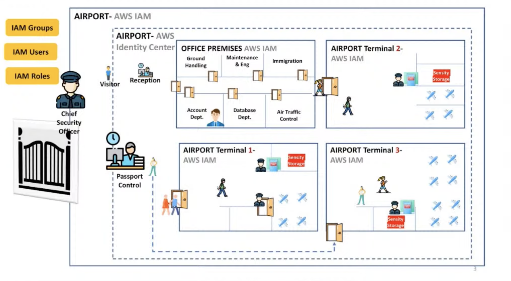

# AWS Identity Center and Permission Sets 

## Overview
AWS IAM governs how individual identities interact with AWS services (e.g configuring EC2, managing S3 buckets). 

In order word, IAM is use to securely control access to all cloud resources.

## Identity vs Authorization

Alternatively, it tracks who has access and whats can be done with any particular service. It manages **Authentication** and **Authorization** on cloud.

### Identity (Authentication)

Identity answers the question:
`Who are you?`

It is the process of verifying the entity attempting to access a system.

In Amazon Web Services, identity is handled through services like:
- AWS Identity and Access Management (IAM)
- AWS IAM Identity Center
- Federation via SAML/OIDC providers

Examples of Identities in AWS:
- IAM User
- IAM Role
- Federated user (via Identity Center or external IdP)
- Application/service assuming a role
- EC2 instance profile

Authentication can be done using:

- Username & password
- Access key & secret key
- Multi-Factor Authentication (MFA)
- SAML assertion
- OIDC token
- STS temporary credentials

### Authorization

Authorization answers the question:`What are you allowed to do?`

It defines permissions after identity has been authenticated.

Authorization in AWS is controlled by:
- IAM policies
- Permission sets (Identity Center)
- Resource-based policies
- Service control policies (SCPs)

Example:

User tries to delete an S3 bucket.

- If IAM policy allows `s3:DeleteBucket` → permitted.
- If not allowed or explicitly denied → access denied.

## IAM user Versus AWS Identity Center

### IAM User
An IAM User is a long-term identity created inside a single AWS account.

It has:
- Username
- Password (optional)
- Access keys (long-term credentials)
- Attached IAM policies

Characteristics
- Account-specific (does not span multiple accounts)
- Uses long-lived credentials
- Permissions are attached directly or via IAM groups
- No native multi-account SSO

###  AWS Identity Center

AWS Identity Center is a centralized identity and access management service that enables organizations to manage single sign-on (SSO) access to:

It is used to:
- Manages users and groups centrally
- Uses permission sets instead of direct policies
- Automatically provisions IAM roles in target accounts
- Issues short-lived credentials

Characteristics
- Multiple AWS accounts
- AWS applications (e.g., QuickSight)
- Third-party SaaS applications (e.g., Salesforce, Microsoft 365)
- Custom SAML 2.0 applications

It is tightly integrated with **Amazon Web Services** and is typically used in multi-account environments managed through AWS Organizations.

- AWS Identity Center solves the following problems:
- Centralized authentication across multiple AWS accounts
- Simplified user and group management
- Fine-grained, permission-set-based access control
- Secure workforce identity federation
- Reduced IAM user sprawl

## Lab Work: Comparing IAM Users and AWS Identity Center

By the end of this lab, students will:
- Understand limitations of IAM Users
- Configure AWS IAM Identity Center
- Create Permission Sets
- Assign users to multiple accounts
- Observe automatic IAM role provisioning
- Compare authentication & authorization behavior

### Lab 1: IAM User (Single Account Model)

Accounts:
- Management Account
- Dev Account
- Prod Account

#### Step 1: Create IAM User
1. Go to IAM → Users → Create User
2. Username: dev_user
3. Enable Console access
4. Attach policy:
    - AmazonEC2ReadOnlyAccess

#### Step 2: Login as IAM User
- Log in via account-specific URL.
- Try to:
    - View EC2 instances (works)
    - Delete instance (fails)

### Lab 2: Setup AWS Identity Center

#### Step 1: Enable Identity Center
From Management Account:
- Open Identity Center
- Enable it
- Choose:
    - Identity Center directory

#### Create Users & Groups

1. Create Users
    - Create:
        - alice
        - bob

2. Create Groups
    - Developers
    - Admins

3. Add:
    - Alice → Developers
    - Bob → Admins

4. Create Permission Sets

Permission Set 1: Dev-ReadOnly
- Attach:
    - AmazonEC2ReadOnlyAccess
- Session duration: 
    - 4 hours

Permission Set 2: Admin-FullAccess
- Attach:
    - AdministratorAccess

    

Resources:
- https://docs.aws.amazon.com/pdfs/IAM/latest/UserGuide/iam-ug.pdf#best-practices-use-cases
- https://dev.to/aws-builders/aws-users-roles-and-identity-center-demystified-55g9