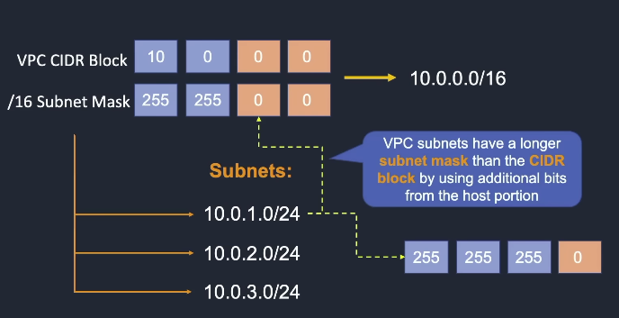

# AWS Networking 
## VPC, Subnets, and Routing Control

Core concepts every cloud engineer must master:

- VPC
- CIDR blocks
- Subnets: IP range within VPC (Private and Public)
- Route tables
- Internet Gateway
- NAT Gateway
- Security Groups
- Network ACL (NACL)
- Multi-AZ architecture
- VPC connectivity


## 1. What is a VPC?

A **Virtual Private Cloud (VPC)** is a logically isolated virtual network in **AWS** where you can launch and manage your cloud resources. Its like having your own data center inside AWS

It provides full control over:

- IP addressing
- Subnet configuration
- Route tables
- Internet access
- Security rules

Think of a **VPC as your own private data center network inside AWS**.

Example resources that live inside a VPC:

- EC2 instances
- RDS databases
- Elastic Load Balancers
- ECS / EKS clusters
- Lambda functions (when configured)


### Key Characteristics of a VPC

| Feature | Description |
|------|------|
| Isolation | Your VPC is isolated from other AWS customers |
| Custom IP range | Define your own CIDR block |
| Subnet segmentation | Split network into smaller networks |
| Routing control | Control traffic flow |
| Security control | Use Security Groups and NACLs |
| Internet access control | Public or private access |

### VPC Components
- **Virtual Private Cloud (VPC)**: A logically isolated virual network in the AWS cloud.
- **Subnet**: A segment of a VPC's IP address range where you can place groups of isolated resources
- **Internet Gateway/Egress-only Internet Gateway Router**: The Amazon VPC side of a connection to the public Internet for IPv4/IPv6
- **Router**: Routers interconnect subnets and direct traffic between Internet gateways, virtual private gateways, NAT gateways, and subnets
- **Peering Connection**:Direct connection between two VPCS
- **VPC Endpoints**:Private connection to public AWS services
- **NAT Instance**:Enables Internet access for EC2 instances in private subnets managed by you)
- **NAT Gateway**: Enables Internet access for EC2 instances in private subnets (managed by AWS)
- **Virtual Private Gateway**: The Amazon VPC side of a Virtual Private Network (VPN) connection
- **Customer Gateway**: Customer side of a VPN connection
- **AWS Direct Connect**: High speed, high bandwidth, private network connection from customer to aws
- **Security Group**: Instance-level firewall
- **Network ACL**: Subnet-level firewall


## 2. CIDR Block (IP Address Range)

When creating a VPC you must specify a range of IPv4 addresses for the VPC in the form of  Classless Inter-Domain Routing (**CIDR block**); for example, 10.0.0.0/16.

### Defining VPC CIDR Blocks

CIDR defines the range of IP addresses available in the network.

### Rules and Guidelines to creating CIDR Block

- CIDR block size can be between /16 and /28
- The CIDR block must not overlap with any existing CIDR block that's associated with the VPC
- You cannot increase or decrease the size of an existing CIDR block
- The first four and last IP address are not available for use
- AWS recommend you use CIDR blocks from the RFC 1918 ranges:

| RFC 1918 Range | Example CIDR Block |
|-----|-----|
| 10.0.0.0-10.255.255.255 (10/8 prefix) | Your VPC must be /16 or smaller, for example, 10.0.0.0/16 |
| 172.16.0.0 - 172.31.255.255 (172.16/12 prefix) | Your VPC must be /16 or smaller, for example, 172.31.0.0/16 |
| 192.168.0.0 - 192.168.255.255 (192.168/16 prefix) | Your VPC can be smaller, for example 192.168.0.0/20 |

### VPC CIDR Blocks and Subnets



Common VPC ranges:

| CIDR | Total IPs |
|-----|-----|
| /16 | 65,536 |
| /20 | 4096 |
| /24 | 256 |


## 3. What is a Subnet?

A **Subnet** is a smaller network created from a VPC.

It allows you to organize infrastructure into **logical network segments**.


## Why Subnets are Important

Subnets allow:

- Isolation of services
- Security segmentation
- High availability
- Routing control
- Layered architecture


## 4. Public vs Private Subnets

### Public Subnet

A subnet is **public** if it has a route to an **Internet Gateway (IGW)**.

Used for:

- Load Balancers
- Bastion Hosts
- NAT Gateways
- Public Web Servers


### Private Subnet

A subnet is **private** if it does NOT have direct internet access.

Used for:

- Application servers
- Databases
- Internal microservices


## 5. Internet Gateway (IGW)

An **Internet Gateway** allows resources in a VPC to connect to the internet.

Key characteristics:

- Horizontally scalable
- Highly available
- Managed by AWS

Traffic flow:

EC2 → Route Table → Internet Gateway → Internet


## 6. NAT Gateway

A **NAT Gateway** allows **private subnet instances to access the internet** without exposing them publicly.

Use cases:

- Software updates
- API calls
- Downloading packages

Traffic flow:
```bash
Private EC2
↓
NAT Gateway (Public Subnet)
↓
Internet Gateway
↓
Internet
```

## Lab Work


### Create VPC 
Name: MyVPC
IPv4 CIDR Block: 10.0.0.0/16

### Create Public Subnets
Name: Public-1A
Availability Zone: eu-west-1a 
IPv4 CIDR Block: 10.0.1.0/24

Name: Public-1B
Availability Zone: eu-west-1b 
IPv4 CIDR Block: 10.0.2.0/24

Name: Private-1A
Availability Zone: us-west-1a 
IPv4 CIDR Block: 10.0.3.0/24

Name: Private-1B
Availability Zone: us-west-1b 
IPv4 CIDR Block: 10.0.4.0/24

### Create private route table
Name: Private-RT
VPC: MyVPC
Subnet associations: Private-1A, Private-1B

### Create Internet Gateway
Name: MyIGW
VPC: MyVPC

